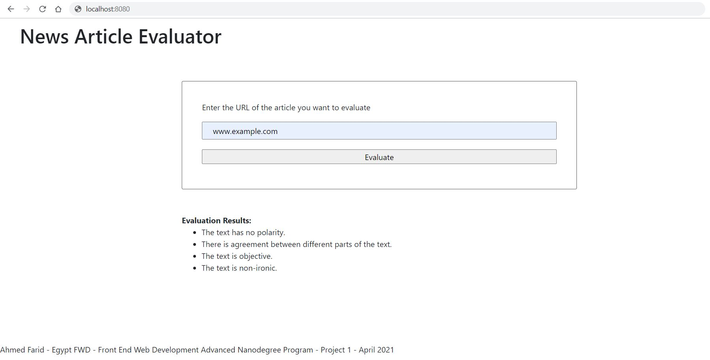

This is the first project in the "Front End Web Development Advanced" Nanodegree from Udacity, sponsored by the Ministry of Communications and Information Technology of Egypt. You can view my certificate [here](https://graduation.udacity.com/confirm/DNG9L9CK).

# News Article Evaluator

The News Article Evaluator is a web tool that takes the URL of an article and performs Natural Language Processing on that article.



## Running the web tool locally

Before proceeding, please make sure that the following tools are installed on your machine:

- [Git](https://git-scm.com/)

- [Node.js](https://nodejs.org/)

Please follow the following steps to run the web tool on your machine:

### Step 1: Fork and clone the repository

Fork the repository to your GitHub account, then clone it to your machine in an empty directory.

### Step 2: Install the dependencies

Run ```npm install``` in the repository's root directory to install the needed dependencies.

### Step 3: Build the application

Run ```npm run build-prod``` in the repository's root directory to build the application.

### Step 4: Start the application

Run ```npm start``` in the repository's root directory to start the application on your machine.

Go to [localhost:8080](localhost:8080) to launch the application.
